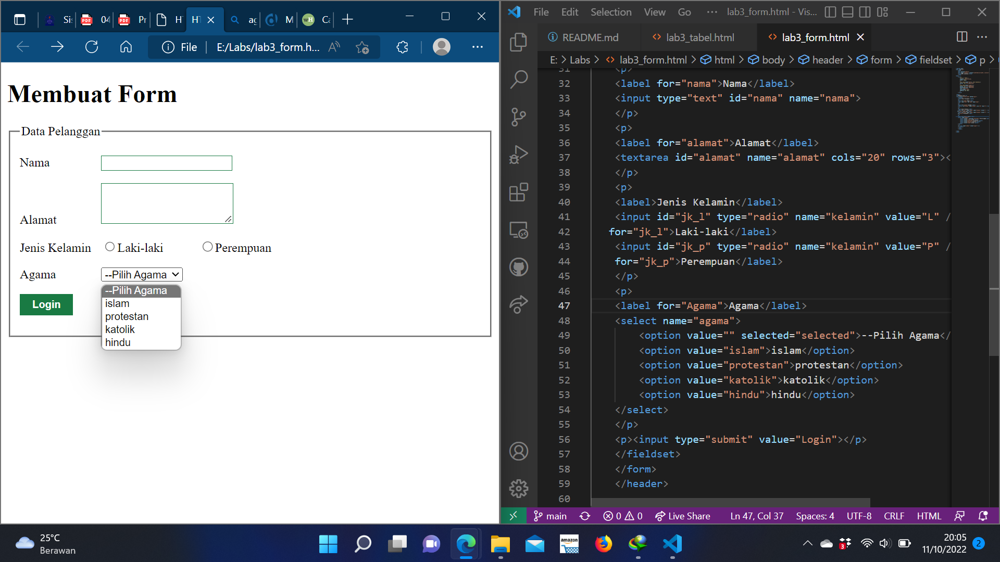

# Lab3Web

# Langkah-langkah Praktikum

# 1. Membuat Ordered List
Kemudian tambahkan kode untuk membuat Ordered List seperti berikut

# 2. Membuat Unorderd List
Kemudian tambakan kode untuk membuat Unordered List setelah deklarasi ordered list pada section unordered-list, seperti berikut.

# 3.Membuat Description List
Kemudian tambahkan kode untuk membuat description list setelah deklarasi unorderd-list.

# 4.Membuat Tabel
Buat file baru dengan nama lab3_tabel.html seperti berikut.
dan cara mengatur Mengatur Margin dan Padding Untuk mengatur margin dan padding pada cel data, tambahkan atribut cellpadding dan cellspacing pada tag table.

# 5.Menggabungkan Sel Data
Untuk menggabungkan sel data, gunakan atribut rowspan dan colspan. Atribut rowspan untuk menggabungkan baris (secara vertikal) dan colspan untuk menggabungkan kolom (secara horizontal). 

# 6.Membuat Form
Buat file baru dengan nama lab3_form.html seperti berikut.

# 7.Menabahkan Style pada Form
Agar tampilan form lebih menarik, bisa ditambahkan CSS seperti berikut.

# Jawaban dari Pertanyaan dan Tugas
Buatlah form yang menampilkan dropdown menu dan listbox dengan multiple selection.

# dropdown menu

# listbox
